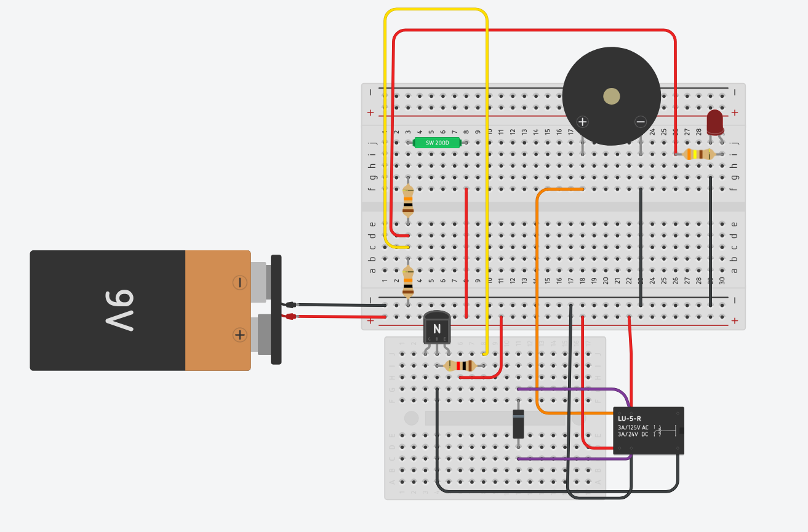
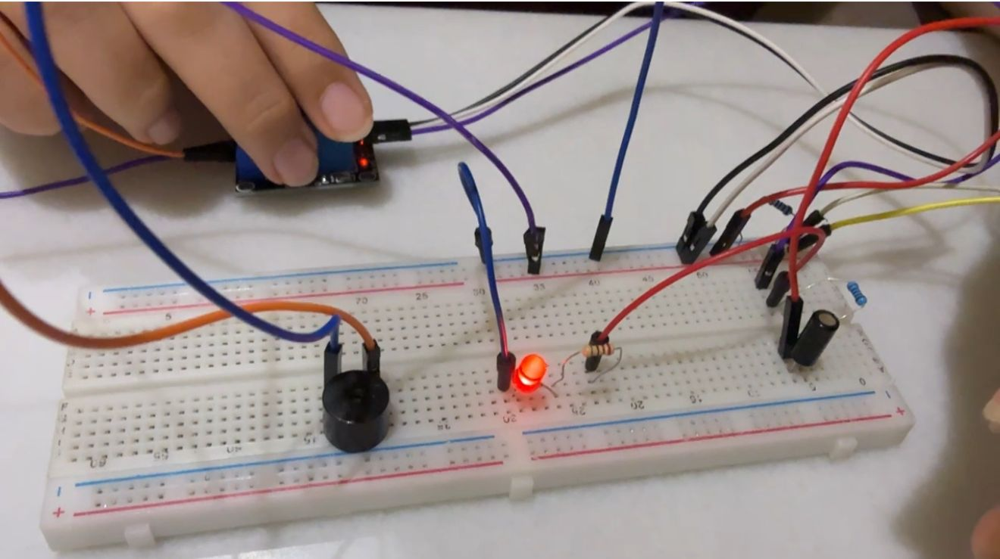
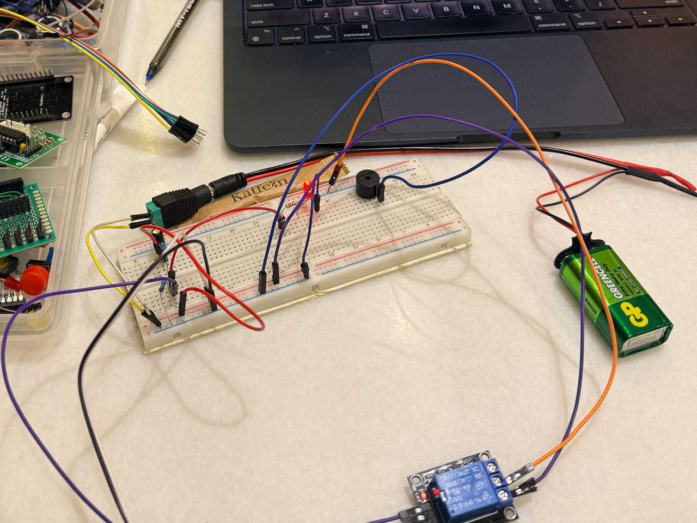

```
███╗   ██╗ █████╗      ██╗ █████╗ ██████╗  █████╗ ████████╗    ███████╗ ██████╗ ██████╗ ██╗  ██╗██╗██╗   ██╗███████╗██╗   ██╗ █████╗ 
████╗  ██║██╔══██╗     ██║██╔══██╗██╔══██╗██╔══██╗╚══██╔══╝    ██╔════╝██╔═══██╗██╔══██╗██║  ██║██║╚██╗ ██╔╝██╔════╝██║   ██║██╔══██╗
██╔██╗ ██║███████║     ██║███████║██████╔╝███████║   ██║       ███████╗██║   ██║██████╔╝███████║██║ ╚████╔╝ █████╗  ██║   ██║███████║
██║╚██╗██║██╔══██║██   ██║██╔══██║██╔══██╗██╔══██║   ██║       ╚════██║██║   ██║██╔═══╝ ██╔══██║██║  ╚██╔╝  ██╔══╝  ╚██╗ ██╔╝██╔══██║
██║ ╚████║██║  ██║╚█████╔╝██║  ██║██████╔╝██║  ██║   ██║       ███████║╚██████╔╝██║     ██║  ██║██║   ██║   ███████╗ ╚████╔╝ ██║  ██║
╚═╝  ╚═══╝╚═╝  ╚═╝ ╚════╝ ╚═╝  ╚═╝╚═════╝ ╚═╝  ╚═╝   ╚═╝       ╚══════╝ ╚═════╝ ╚═╝     ╚═╝  ╚═╝╚═╝   ╚═╝   ╚══════╝  ╚═══╝  ╚═╝  ╚═╝
                                                                                                                                     
```

### Physics Guide Series — Electronics & Circuit Theory
**Najabat Sophiyeva** · Baku, Azerbaijan · 2026

[](https://www.linkedin.com/in/physics-teacher-azerbaijan-telman-askeraliyev/)
[](https://www.academia.edu/NajabatSophiyeva)
[](https://www.slideshare.net/najabatsophiyeva)
[](https://youtu.be/esIwqgL-f1E?si=KdTRGP6Y8rYLGAHC)
[](https://www.tinkercad.com)

> Visual guides, lab reports, and engineering projects on electronics —
> created by Najabat Sophiyeva, verified by Physics Teacher Telman Askeraliyev · Baku, Azerbaijan.

---

## Index

| # | Topic | Link | Author | Verified |
|---|-------|------|--------|----------|
| 01 | Physics Guide: Field Effect Transistors | [Academia](https://www.academia.edu/165906555) · [SlideShare](https://www.slideshare.net/slideshow/physics-guide-field-effect-transistors-nijat-mazanli-najabat-sophiyeva-verified-by-physics-teacher-azerbaijan-telman-askeraliyev-fizika-muellimi-azerbaijan-baku/287120657) | Najabat Sophiyeva · Nijat Mazanli | verified by: physics teacher azerbaijan telman askeraliyev (fizika muellimi) – [LinkedIn](https://www.linkedin.com/in/physics-teacher-azerbaijan-telman-askeraliyev/) · [Instagram](https://www.instagram.com/physics_teacher_azerbaijan) |
| 02 | Physics Guide: Amplifiers & Applications | [Academia](https://www.academia.edu/165709848) · [SlideShare](https://www.slideshare.net/slideshow/physics-guide-amplifiers-and-applications-lesson-presentation-and-practical-insights-nijat-mazanlli-najabat-sophiyeva-verified-by-physics-teacher-azerbaijan-telman-askeraliyev-fizika-muellimi-azerbaijan-baku/287037260) | Najabat Sophiyeva · Nijat Mazanli | verified by: physics teacher azerbaijan telman askeraliyev (fizika muellimi) – [LinkedIn](https://www.linkedin.com/in/physics-teacher-azerbaijan-telman-askeraliyev/) · [Instagram](https://www.instagram.com/physics_teacher_azerbaijan) |
| 03 | Technical Laboratory Report: Transistor | [SlideShare](https://www.slideshare.net/slideshow/technical-laboratory-report-transistor-report-nijat-mazanli-najabat-sofiyeva-verified-by-physics-teacher-azerbaijan-telman-askeraliyev-fizika-muellimi-azerbaijan-baku/286914601) | Najabat Sophiyeva · Nijat Mazanli | verified by: physics teacher azerbaijan telman askeraliyev (fizika muellimi) – [LinkedIn](https://www.linkedin.com/in/physics-teacher-azerbaijan-telman-askeraliyev/) · [Instagram](https://www.instagram.com/physics_teacher_azerbaijan) |
| 04 | Capacitor — Visual Guide | [SlideShare](https://www.slideshare.net/slideshow/capacitor-najabat-sofiyeva-and-nijat-mazanli-verified-by-physics-teacher-azerbaijan-telman-askeraliyev-fizika-muellimi-azerbaijan-baku/286799493) | Najabat Sophiyeva · Nijat Mazanli | verified by: physics teacher azerbaijan telman askeraliyev (fizika muellimi) – [LinkedIn](https://www.linkedin.com/in/physics-teacher-azerbaijan-telman-askeraliyev/) · [Instagram](https://www.instagram.com/physics_teacher_azerbaijan) |
| 05 | Physics Guide: Voltage Divider | [SlideShare](https://www.slideshare.net/slideshow/physics-guide-voltage-divider-nijat-mazanli-najabat-sophiyeva-verified-by-physics-teacher-azerbaijan-telman-askeraliyev-fizika-muellimi-azerbaijan-baku/287278278) | Najabat Sophiyeva · Nijat Mazanli | verified by: physics teacher azerbaijan telman askeraliyev (fizika muellimi) – [LinkedIn](https://www.linkedin.com/in/physics-teacher-azerbaijan-telman-askeraliyev/) · [Instagram](https://www.instagram.com/physics_teacher_azerbaijan) |
| 06 | Azerbaijan Electronics Market — Analysis | [SlideShare](https://www.slideshare.net/slideshow/physics-guide-an-analysis-of-azerbaijan-s-electronics-market-focusing-on-sales-authors-necabet-sofiyeva-nicat-mazanli-verified-by-physics-teacher-azerbaijan-telman-askeraliyev-fizika-muellimi-azerbaijan-baku/287388776) | Najabat Sophiyeva · Nijat Mazanli | verified by: physics teacher azerbaijan telman askeraliyev (fizika muellimi) – [LinkedIn](https://www.linkedin.com/in/physics-teacher-azerbaijan-telman-askeraliyev/) · [Instagram](https://www.instagram.com/physics_teacher_azerbaijan) |
| 07 | Technical Lab Report: Tilt Sensor Alarm ⭐ | [Academia](https://www.academia.edu/167374803) · [SlideShare](https://www.slideshare.net/slideshow/technical-laboratory-report-alarm-system-with-tilt-sensor-by-najabat-sofiyeva-verified-by-physics-teacher-azerbaijan-telman-askeraliyev-fizika-muellimi-azerbaijan-baku/287595111) · [▶ YouTube](https://youtu.be/esIwqgL-f1E?si=KdTRGP6Y8rYLGAHC) | Najabat Sophiyeva | verified by: physics teacher azerbaijan telman askeraliyev (fizika muellimi) – [LinkedIn](https://www.linkedin.com/in/physics-teacher-azerbaijan-telman-askeraliyev/) · [Instagram](https://www.instagram.com/physics_teacher_azerbaijan) |

---

--------------------
## 01 — Physics Guide: Field Effect Transistors

[Academia.edu](https://www.academia.edu/165906555) · [SlideShare](https://www.slideshare.net/slideshow/physics-guide-field-effect-transistors-nijat-mazanli-najabat-sophiyeva-verified-by-physics-teacher-azerbaijan-telman-askeraliyev-fizika-muellimi-azerbaijan-baku/287120657)

verified by: physics teacher azerbaijan telman askeraliyev (fizika muellimi) – [LinkedIn](https://www.linkedin.com/in/physics-teacher-azerbaijan-telman-askeraliyev/) · [Instagram](https://www.instagram.com/physics_teacher_azerbaijan)

# Physics Guide: Field Effect Transistors — JFET & MOSFET

A 13-page comprehensive visual guide on Field Effect Transistors — JFET and MOSFET structure, operating regions, biasing circuits, key parameters, and device comparison. Includes worked calculation problems and exam-style exercises.

**Authors:** Najabat Sophiyeva · Nijat Mazanli
**Verified by:** Telman Askeraliyev — Physics Teacher, Azerbaijan, Baku (Fizika Muellimi)

---

## Slide Overview

| # | Section | Content |
|---|---------|---------|
| 1 | What is a FET? | Voltage-controlled device, Gate/Drain/Source terminals, BJT vs FET |
| 2 | JFET Working Principle | PN-junction gate, N-channel / P-channel, depletion region behaviour |
| 3 | JFET Characteristics | Ohmic, Saturation, Cutoff regions; drain characteristic curves |
| 4 | JFET Key Parameters | I_DSS, V_P, g_m, V_GS, I_D, V_DS — definitions and units |
| 5 | JFET Biasing | Self-bias (R_S method), voltage-divider bias, Q-point selection |
| 6 | Ohmic Region | V_DS < V_GS − V_P, on-resistance r_DS(on), switch applications |
| 7 | MOSFET Structure | SiO₂ insulated gate, E-MOSFET vs D-MOSFET, threshold voltage V_T |
| 8 | MOSFET Characteristics | Cut-off, Triode/Linear, Saturation — conditions and formulas |
| 9 | MOSFET Biasing | Feedback bias, voltage-divider bias, zero-bias (D-MOSFET) |
| 10 | JFET vs MOSFET | 8-property comparison — impedance, channel, V_GS range, noise, power |
| 11 | Summary | Key points for JFET, MOSFET, and Ohmic region — exam checklist |
| 12–13 | Questions & Exercises | 10 conceptual, 5 calculation problems, 6 True/False |

---

## Key Equations

| Quantity | Formula |
|----------|---------|
| Shockley equation (JFET, saturation) | `I_D = I_DSS × (1 − V_GS / V_P)²` |
| Transconductance | `g_m = (2 × I_DSS / \|V_P\|) × (1 − V_GS / V_P)` |
| E-MOSFET saturation current | `I_D = k × (V_GS − V_T)²` |
| Conduction parameter | `k = I_D(on) / (V_GS(on) − V_T)²` |
| On-resistance (Ohmic region) | `r_DS(on) = V_DS / I_D` |
| JFET self-bias | `V_GS = −I_D × R_S` |
| Voltage-divider gate voltage | `V_G = V_DD × R2 / (R1 + R2)` |

---

## JFET vs MOSFET Comparison

| Property | JFET | E-MOSFET | D-MOSFET |
|----------|------|----------|----------|
| Gate insulation | PN junction (reverse biased) | SiO₂ oxide layer | SiO₂ oxide layer |
| Input impedance | ~10⁷ Ω | ~10¹⁴ Ω | ~10¹⁴ Ω |
| Channel at V_GS = 0 | ✅ ON | ❌ OFF | ✅ ON |
| V_GS polarity (N-ch) | 0 to negative | Must be positive (> V_T) | Positive or negative |
| Zero bias possible? | No | No | Yes |
| Gate current | Very small leakage | Almost zero | Almost zero |
| Main use | Low-noise analog amplifiers | Digital circuits, power switching | Analog amplifiers |

---

## Subject

- **Field:** Electronics / Semiconductor Devices
- **Type:** Visual Physics Guide
- **Pages:** 13
- **Language:** English
- **Location:** Azerbaijan, Baku

--------------------
## 02 — Physics Guide: Amplifiers & Applications

[Academia.edu](https://www.academia.edu/165709848) · [SlideShare](https://www.slideshare.net/slideshow/physics-guide-amplifiers-and-applications-lesson-presentation-and-practical-insights-nijat-mazanlli-najabat-sophiyeva-verified-by-physics-teacher-azerbaijan-telman-askeraliyev-fizika-muellimi-azerbaijan-baku/287037260)

verified by: physics teacher azerbaijan telman askeraliyev (fizika muellimi) – [LinkedIn](https://www.linkedin.com/in/physics-teacher-azerbaijan-telman-askeraliyev/) · [Instagram](https://www.instagram.com/physics_teacher_azerbaijan)

# Physics Guide: Amplifiers & Applications — Gain, Classes, Feedback, Op-Amp

A 16-page lesson presentation on amplifier theory — from basic gain to Op-Amp configurations, amplifier classes, frequency response, and negative feedback. Covers real-world applications from smartphones to ECG machines. References AQA / OCR / Edexcel A-Level specifications.

**Authors:** Najabat Sophiyeva · Nijat Mazanli
**Verified by:** Telman Askeraliyev — Physics Teacher, Azerbaijan, Baku (Fizika Muellimi)

---

## Slide Overview

| # | Section | Content |
|---|---------|---------|
| 1 | What is an Amplifier? | Definition, tap analogy, power supply role, common ICs (LM741, LM358) |
| 2 | Types of Gain | Voltage (A_V), Current (A_I), Power (A_P), dB scale |
| 3 | Input / Output Impedance | Z_in (high = good), Z_out (low = good), loading effects |
| 4 | Amplifier Classes | Class A, B, AB, C, D — conduction angle, efficiency, distortion |
| 5 | Frequency Response | Bode plot, −3 dB cutoff points, midband region |
| 6 | Bandwidth | BW = f_H − f_L; −3 dB definition; audio vs RF examples |
| 7 | Negative Feedback | Gain stability, distortion reduction, Z_in↑, Z_out↓ |
| 8 | Op-Amp Internals | Differential input, open-loop gain, slew rate, GBW product |
| 9 | Op-Amp Configurations | Inverting (−R_f/R_in) and Non-inverting (1 + R_f/R_in) |
| 10 | Real-World Applications | Smartphones, ECG, radio, guitar pedals, EVs, CCTV |
| 11–12 | Exam Tips & Common Q&A | 5 exam questions with full model answers |
| 13–14 | Visual Summary | Formula quick-reference, key vocabulary table |
| 15–16 | References | Sedra & Smith, Horowitz & Hill, AQA/OCR/Edexcel specs, TI datasheets |

---

## Key Equations

| Quantity | Formula |
|----------|---------|
| Voltage gain | `A_V = V_out / V_in` |
| Power gain | `A_P = P_out / P_in` |
| Voltage gain in dB | `A_dB = 20 × log₁₀(A_V)` |
| Bandwidth | `BW = f_H − f_L` |
| Closed-loop gain (neg. feedback) | `A_CL = A / (1 + A·β)` |
| Inverting Op-Amp gain | `A_V = −R_f / R_in` |
| Non-inverting Op-Amp gain | `A_V = 1 + (R_f / R_in)` |
| Gain–Bandwidth product | `GBW = A_V × BW = constant` |

---

## Amplifier Classes

| Class | Conduction Angle | Efficiency | Distortion | Typical Use |
|-------|-----------------|------------|------------|-------------|
| A | 360° (full cycle) | ≈ 25% | Very low | Hi-fi audio, mic preamps |
| B | 180° (half cycle) | ≈ 78% | High (crossover) | Push-pull power stages |
| AB | 180°–360° | ≈ 50–70% | Low | Most audio power amps |
| C | < 180° | > 90% | Very high | RF transmitters |
| D | Switching (PWM) | ≈ 90–98% | Low (filtered) | Phones, Bluetooth, subwoofers |

---

## Subject

- **Field:** Electronics / Analog Circuits
- **Type:** Lesson Presentation & Practical Insights
- **Pages:** 16
- **Language:** English
- **Location:** Azerbaijan, Baku

--------------------
## 03 — Technical Laboratory Report: Transistor

[SlideShare](https://www.slideshare.net/slideshow/technical-laboratory-report-transistor-report-nijat-mazanli-najabat-sofiyeva-verified-by-physics-teacher-azerbaijan-telman-askeraliyev-fizika-muellimi-azerbaijan-baku/286914601)

verified by: physics teacher azerbaijan telman askeraliyev (fizika muellimi) – [LinkedIn](https://www.linkedin.com/in/physics-teacher-azerbaijan-telman-askeraliyev/) · [Instagram](https://www.instagram.com/physics_teacher_azerbaijan)

# Technical Laboratory Report: Transistor — Switch, Amplifier, NPN vs PNP

An 11-page complete physics guide on BJT transistors — covering semiconductor basics, three-terminal operation, switch mode (saturation / cut-off), amplifier mode with current gain, NPN vs PNP comparison, and real-world applications.

**Authors:** Najabat Sophiyeva · Nijat Mazanli
**Verified by:** Telman Askeraliyev — Physics Teacher, Azerbaijan, Baku (Fizika Muellimi)

---

## Topics Covered

- What is a transistor — semiconductor device invented 1947 at Bell Labs (Nobel Prize 1956)
- Three terminals: Base (B) control · Collector (C) input · Emitter (E) output/GND
- As a **switch** — two states: ON (saturation, I_B > threshold) and OFF (cut-off, I_B = 0)
- As an **amplifier** — small I_B controls large I_C; current gain β = I_C / I_B
- NPN vs PNP — layer structure, turn-on polarity, current direction, typical use
- Real-world applications — smartphones (16 billion transistors/chip), RAM, radio, audio, medical devices
- Key vocabulary — semiconductor, β, saturation, cut-off, biasing, BJT, MOSFET, logic gate
- Exam tips and 4 common exam questions with full model answers

---

## Key Equations

| Quantity | Formula |
|----------|---------|
| Current gain (hFE) | `β = I_C / I_B` |
| Collector current | `I_C = β × I_B` |
| Base-emitter voltage drop | `V_BE ≈ 0.7 V` (silicon NPN) |
| Saturation condition | `I_B ≥ I_C / β` |

---

## NPN vs PNP

| Feature | NPN | PNP |
|---------|-----|-----|
| Semiconductor layers | N – P – N | P – N – P |
| Turns ON when | Positive voltage at Base | Negative voltage at Base |
| Current direction (C→E) | Collector → Emitter | Emitter → Collector |
| How common | Very common | Less common |
| Symbol arrow | Points outward on Emitter | Points inward on Emitter |
| Typical use | Digital logic, amplifiers | Complementary push-pull |

---

## Subject

- **Field:** Electronics / Semiconductor Devices
- **Type:** Technical Laboratory Report
- **Pages:** 11
- **Language:** English (B1 level)
- **Location:** Azerbaijan, Baku

--------------------
## 04 — Capacitor — Visual Guide

[SlideShare](https://www.slideshare.net/slideshow/capacitor-najabat-sofiyeva-and-nijat-mazanli-verified-by-physics-teacher-azerbaijan-telman-askeraliyev-fizika-muellimi-azerbaijan-baku/286799493)

verified by: physics teacher azerbaijan telman askeraliyev (fizika muellimi) – [LinkedIn](https://www.linkedin.com/in/physics-teacher-azerbaijan-telman-askeraliyev/) · [Instagram](https://www.instagram.com/physics_teacher_azerbaijan)

# Capacitor — Fundamentals, RC Time Constant & Applications

A visual guide on capacitor theory — charge storage, types, charging and discharging curves, RC time constant, energy storage formula, and practical circuit applications. Covers series and parallel combinations with worked examples.

**Authors:** Najabat Sophiyeva · Nijat Mazanli
**Verified by:** Telman Askeraliyev — Physics Teacher, Azerbaijan, Baku (Fizika Muellimi)

---

## Topics Covered

- **Structure** — Two conductive plates separated by a dielectric insulator
- **Charging** — Exponential voltage rise; positive and negative charges on opposite plates
- **Discharging** — Exponential voltage decay; energy released to circuit
- **Types** — Ceramic (stable, small), Electrolytic (polarized, high C), Film (precision), Variable
- **RC Time Constant** — τ = R × C; at t = τ, capacitor reaches 63.2% of V_max
- **Energy storage** — E = ½ × C × V²
- **Series & parallel** — Different combination rules vs resistors
- **Applications** — Power supply smoothing, timing circuits, coupling/decoupling, energy storage

---

## Key Equations

| Quantity | Formula |
|----------|---------|
| Capacitance | `C = Q / V` (Farads) |
| RC time constant | `τ = R × C` (seconds) |
| Energy stored | `E = ½ × C × V²` (Joules) |
| Charging voltage at time t | `V(t) = V_max × (1 − e^(−t/τ))` |
| Discharging voltage at time t | `V(t) = V_0 × e^(−t/τ)` |
| Capacitors in series | `1/C_total = 1/C₁ + 1/C₂ + ...` |
| Capacitors in parallel | `C_total = C₁ + C₂ + ...` |

---

## Subject

- **Field:** Electronics / Passive Components
- **Type:** Visual Guide
- **Language:** English
- **Location:** Azerbaijan, Baku

--------------------
## 05 — Physics Guide: Voltage Divider

[SlideShare](https://www.slideshare.net/slideshow/physics-guide-voltage-divider-nijat-mazanli-najabat-sophiyeva-verified-by-physics-teacher-azerbaijan-telman-askeraliyev-fizika-muellimi-azerbaijan-baku/287278278)

verified by: physics teacher azerbaijan telman askeraliyev (fizika muellimi) – [LinkedIn](https://www.linkedin.com/in/physics-teacher-azerbaijan-telman-askeraliyev/) · [Instagram](https://www.instagram.com/physics_teacher_azerbaijan)

# Physics Guide: Voltage Divider — Theory, Loading Effects & Sensor Applications

A visual physics guide on the voltage divider — covering mathematical derivation, loading effects, BJT biasing, LDR sensor circuits, logic level shifting, and potentiometer use.

**Authors:** Najabat Sophiyeva · Nijat Mazanli
**Verified by:** Telman Askeraliyev — Physics Teacher, Azerbaijan, Baku (Fizika Muellimi)

---

## Topics Covered

- **Core principle** — Two resistors in series sharing a supply voltage proportionally
- **Formula derivation** — Step-by-step proof of V_out = V_in × R2 / (R1 + R2)
- **Loading effects** — How a parallel load R_L reduces V_out; effective resistance calculation
- **LDR sensor circuit** — V_out = V_S × R_pot / (R_LDR + R_pot); light level → voltage → threshold switch
- **BJT base biasing** — Setting Q-point with a voltage-divider network
- **Logic level shifting** — 5V → 3.3V for ESP32 / STM32 microcontrollers
- **Potentiometer** — Variable divider; wiper position controls output voltage continuously

---

## Key Equations

| Quantity | Formula |
|----------|---------|
| Divider output (unloaded) | `V_out = V_in × R2 / (R1 + R2)` |
| Divider ratio | `k = R2 / (R1 + R2)` |
| Series branch current | `I = V_in / (R1 + R2)` |
| Effective R2 under load | `R2_eff = R2 × R_L / (R2 + R_L)` |
| Loaded output | `V_out = V_in × R2_eff / (R1 + R2_eff)` |
| LDR sensor output | `V_out = V_S × R_fixed / (R_LDR + R_fixed)` |

---

## Applications

| Application | Use Case |
|-------------|----------|
| LDR threshold switch | Light level → V_out → transistor base → relay ON/OFF |
| Logic level shifting | 5V microcontroller → 3.3V ESP32 / STM32 input |
| ADC sensor scaling | 0–12V sensor output → 0–5V Arduino analog input |
| BJT base biasing | Set Q-point: V_G = V_DD × R2 / (R1 + R2) |
| Potentiometer | Volume control, brightness adjustment, variable threshold |

---

## Subject

- **Field:** Electronics / Circuit Theory
- **Type:** Visual Physics Guide
- **Language:** English
- **Location:** Azerbaijan, Baku

--------------------
## 06 — Azerbaijan Electronics Market — Analysis

[SlideShare](https://www.slideshare.net/slideshow/physics-guide-an-analysis-of-azerbaijan-s-electronics-market-focusing-on-sales-authors-necabet-sofiyeva-nicat-mazanli-verified-by-physics-teacher-azerbaijan-telman-askeraliyev-fizika-muellimi-azerbaijan-baku/287388776)

verified by: physics teacher azerbaijan telman askeraliyev (fizika muellimi) – [LinkedIn](https://www.linkedin.com/in/physics-teacher-azerbaijan-telman-askeraliyev/) · [Instagram](https://www.instagram.com/physics_teacher_azerbaijan)

# Azerbaijan Electronics Market — Sales Analysis & Strategic Insights

A market research report analyzing the Azerbaijani electronics sector — import costs, component sales trends, local vs international pricing dynamics, and strategic opportunities for students and engineers entering the field.

**Authors:** Najabat Sophiyeva · Nijat Mazanli
**Verified by:** Telman Askeraliyev — Physics Teacher, Azerbaijan, Baku (Fizika Muellimi)

---

## Report Structure

| # | Section | Content |
|---|---------|---------|
| 01 | Market Overview | Azerbaijani electronics sector size, growth trends, key domestic players |
| 02 | Sales Analysis | Component categories (passive, active, MCU modules), demand patterns |
| 03 | Pricing Dynamics | Import costs, local vs. international pricing comparison, markup analysis |
| 04 | Opportunities | Growth areas for students, engineers, and local entrepreneurs |
| 05 | Conclusions | Key takeaways, strategic recommendations, future market outlook |

---

## Subject

- **Field:** Market Research / Economics of Technology
- **Type:** Market Analysis Report
- **Language:** English
- **Location:** Azerbaijan, Baku

--------------------
## 07 — Technical Lab Report: Tilt Sensor Alarm ⭐

[Academia.edu](https://www.academia.edu/167374803/Technical_Laboratory_Report_Alarm_System_with_tilt_sensor_by_Najabat_Sofiyeva_Verified_by_Physics_Teacher_Azerbaijan_Telman_Askeraliyev_Fizika_Muellimi_Azerbaijan_Baku_) · [SlideShare](https://www.slideshare.net/slideshow/technical-laboratory-report-alarm-system-with-tilt-sensor-by-najabat-sofiyeva-verified-by-physics-teacher-azerbaijan-telman-askeraliyev-fizika-muellimi-azerbaijan-baku/287595111) · [▶ YouTube](https://youtu.be/esIwqgL-f1E?si=KdTRGP6Y8rYLGAHC)

verified by: physics teacher azerbaijan telman askeraliyev (fizika muellimi) – [LinkedIn](https://www.linkedin.com/in/physics-teacher-azerbaijan-telman-askeraliyev/) · [Instagram](https://www.instagram.com/physics_teacher_azerbaijan)

# Technical Laboratory Report: Tilt Sensor Activated Alarm System with Relay, Buzzer and LED

A laboratory engineering project on a tilt-activated alarm circuit. The SW-520 tilt sensor acts as a digital trigger — when tilted, it closes and drives the base of a 2N2222 NPN transistor via a 1kΩ resistor. A 10kΩ pull-down resistor holds the base firmly at GND when the sensor is open. When the sensor closes, the transistor saturates, energizing the LU-5-R relay which simultaneously activates the buzzer and red LED. A 1N4148 flyback diode protects the transistor from back-EMF when the relay de-energizes. Built and tested in both TinkerCAD simulation and on a real breadboard. Project Level: 2.6 | Middle School Electronics. Version 1.0 | May 2026.

**Author:** Najabat Sophiyeva
**Verified by:** Telman Askeraliyev — Physics Teacher, Azerbaijan, Baku (Fizika Muellimi)

---

## Project Overview

| Path | Approach | Key Components | Output |
|------|----------|----------------|--------|
| **Tilt Sensor → Transistor → Relay** | Analog NPN switch; sensor = digital trigger | SW-520 · 10kΩ pull-down · 1kΩ R_B · 2N2222 · 1N4148 · LU-5-R (9V) | Buzzer ON + Red LED ON when tilted |

---

**TinkerCAD Simulation:**

<div align="center">
  
</div>

SW-520 tilt sensor → junction node → 1kΩ R_base → 2N2222 base. 10kΩ pull-down from junction to GND. 2N2222 collector → relay coil pin A. Relay coil pin B → 9V. 1N4148 across relay coil (cathode to 9V). Relay NO → 470Ω → LED + Buzzer (+). All returns to GND rail.

---

**Real Breadboard Build — View 1:**

<div align="center">
  
</div>

---

**Real Breadboard Build — View 2:**

<div align="center">
  
</div>

> Physical build mirrors the TinkerCAD simulation exactly. Visible: SW-520 tilt sensor, red LED (illuminated), active buzzer, relay module (HW-482/LU-5-R), 9V GP battery, and color-coded jumper wires.

---

## Components

| Component | Value / Model | Qty | Role in Circuit |
|-----------|--------------|-----|-----------------|
| Tilt Sensor | SW-520 | 1 | Digital switch — closes when tilted (≥45°), opens when flat; ball-type mechanical contact |
| Resistor (pull-down) | 10kΩ | 1 | Holds base at 0V (GND) when sensor open → prevents false trigger from floating base |
| Resistor (base) | 1kΩ | 1 | Limits base current into 2N2222; ensures safe saturation without transistor overdrive |
| NPN Transistor | 2N2222 | 1 | Electronic switch; IC max 600mA, hFE 100–300; saturates when IB ≥ IC/hFE |
| Flyback Diode | 1N4148 | 1 | Reverse-biased across relay coil; clamps back-EMF spike when transistor cuts off |
| Relay | LU-5-R (9V) | 1 | Electromechanical switch; coil R ≈ 200Ω; NO+COM contacts connect load when energized |
| Buzzer | Active 9V | 1 | Internal oscillator — sounds on DC power; no external frequency signal needed; ≥85 dB |
| LED | 5mm Red | 1 | Visual indicator; VF ≈ 2.0V; recommended IF 10–20mA; absolute max 30mA |
| Resistor (LED) | 470Ω | 1 | Limits LED current to 14.9mA — within safe range |
| Battery | 9V DC | 1 | Powers entire circuit including relay coil, buzzer, LED |

---

## Component Specifications

| Component | Key Parameter | Value |
|-----------|--------------|-------|
| SW-520 | Operating voltage | 3V – 12V DC |
| SW-520 | Contact resistance (closed) | < 100Ω |
| SW-520 | Tilt threshold angle | ≈ 45° |
| 2N2222 | IC max | 600mA |
| 2N2222 | VCE max | 40V |
| 2N2222 | hFE (typical) | 100–300 |
| 2N2222 | VBE (saturation) | ~0.7V |
| LU-5-R | Coil voltage | 9V DC |
| LU-5-R | Coil resistance | ~200Ω |
| LU-5-R | Contact rating | 3A / 125V AC · 3A / 24V DC |
| 1N4148 | Forward voltage | 0.7V |
| 1N4148 | Reverse breakdown | 100V |
| 1N4148 | Switching speed | < 4ns |

---

## Pin-by-Pin Connection Guide

| # | From | To | Notes |
|---|------|----|-------|
| 1 | 9V Battery (+) | Breadboard (+) rail | Main positive supply |
| 2 | 9V Battery (−) | Breadboard (−) rail | Ground / common negative |
| 3 | (+) rail | SW-520 pin 1 | Supplies voltage to tilt sensor |
| 4 | SW-520 pin 2 | Junction: R_base (1kΩ) + R_pulldown (10kΩ) | Sensor output node |
| 5 | R_base (1kΩ) other end | 2N2222 Base | Base drive current path |
| 6 | R_pulldown (10kΩ) other end | GND (−) rail | Holds base at 0V when sensor open |
| 7 | 2N2222 Emitter | GND (−) rail | Emitter always to GND in NPN switch |
| 8 | 2N2222 Collector | Relay coil pin A | Collector drives coil current |
| 9 | Relay coil pin B | (+) rail (9V) | Other end of coil to positive supply |
| 10 | 1N4148 Anode | Relay coil pin A / Collector | Diode anode at lower potential |
| 11 | 1N4148 Cathode | Relay coil pin B / (+) rail | Diode cathode at higher potential |
| 12 | Relay COM | (+) rail (9V) | Common contact powered from supply |
| 13 | Relay NO | R_LED (470Ω) pin 1 + Buzzer (+) | Load power through NO contact |
| 14 | R_LED (470Ω) pin 2 | LED Anode (+) | Current-limited LED supply |
| 15 | LED Cathode (−) | GND (−) rail | LED return path |
| 16 | Buzzer (−) | GND (−) rail | Buzzer return path |

---

## How It Works

```
Device TILTED — Alarm ON:
  SW-520 tips past ~45° → internal ball bridges contacts → sensor closes
  → 9V → SW-520 → junction node → 1kΩ R_base → 2N2222 Base → Emitter → GND
  → IB ≈ 8.3 mA injected into base → transistor saturates (VCE ≈ 0.2V)
  → 9V → Relay coil pin B → coil (200Ω) → coil pin A → Collector → Emitter → GND
  → IC ≈ 44 mA energizes relay coil → magnetic field pulls armature → COM connects to NO
  → 9V → COM → NO → 470Ω → Red LED → GND           (LED ON ✅)
  → 9V → COM → NO → Buzzer (+) → internal oscillator → Buzzer (−) → GND  (Buzzer ON ✅)

Device FLAT — Alarm OFF:
  SW-520 returns to flat → ball rolls away → sensor opens
  → 10kΩ pull-down holds base firmly at 0V → VBE = 0V → transistor in cutoff
  → Relay coil current suddenly stops → collapsing magnetic field generates back-EMF spike
  → 1N4148 forward-biases → spike energy dissipates through coil resistance → 2N2222 protected ✅
  → Relay armature springs back → COM disconnects from NO → Buzzer OFF + LED OFF ✅
```

---

## Key Calculations

```
4.1 Relay Coil Current:
  V_supply = 9V, R_coil = 200Ω, VCE(sat) = 0.2V
  I_coil = (V_supply − VCE(sat)) / R_coil
  I_coil = (9 − 0.2) / 200 = 8.8 / 200
  I_coil ≈ 44 mA  ← this is IC

4.2 Minimum Base Current for Saturation (×10 safety factor):
  hFE(min) = 100  (2N2222 worst-case)
  IB_min = IC / hFE = 44 / 100 = 0.44 mA
  IB_required = IB_min × 10 = 4.4 mA  (saturation factor)

4.3 Base Resistor Verification (R_B = 1kΩ):
  V_supply = 9V, VBE = 0.7V, R_base = 1000Ω
  IB = (V_supply − VBE) / R_base
  IB = (9 − 0.7) / 1000 = 8.3 mA
  IB (8.3 mA) >> IB_required (4.4 mA) → transistor guaranteed to saturate ✅

4.4 Pull-Down Resistor (10kΩ):
  When sensor open: V_base = 0V → transistor fully OFF ✅
  When sensor closed: parallel R = 10k || 1k ≈ 909Ω → negligible effect on IB ✅
  Holds base against EMI / leakage currents that could cause false triggers

4.5 LED Current Resistor (R_LED = 470Ω):
  V_supply = 9V, VF_LED = 2.0V
  I_LED = (V_supply − VF_LED) / R_LED
  I_LED = (9 − 2.0) / 470 = 7.0 / 470
  I_LED ≈ 14.9 mA  (within safe range 10–20 mA) ✅
```

---

## Troubleshooting

| Problem | Symptom | Likely Cause | Solution |
|---------|---------|-------------|----------|
| Buzzer/LED always ON even when flat | Cannot turn off | Pull-down resistor missing or not connected to GND | Verify 10kΩ from base node to GND rail |
| Buzzer/LED never turns ON when tilted | No response in any position | Transistor not saturating; wrong resistors; bad connections | Check IB path continuity; verify 1kΩ at base; test sensor with multimeter |
| Transistor gets hot quickly | Overheating within seconds | Not in saturation; VCE high → power dissipated in transistor | Check base current; ensure 2N2222 flat face is oriented correctly |
| Relay clicks but buzzer/LED stay off | Relay activates, no output | Load wired to NC instead of NO | Confirm wires go to NO and COM pins, not NC |
| Inconsistent triggering / chattering | Alarm flickers at threshold angle | Sensor vibration at marginal angle | Physically secure sensor; add 100nF cap across base-GND for debounce |
| Transistor burns out after a few uses | Component failure | Flyback diode missing or reversed | Check 1N4148 orientation: cathode (banded end) to relay coil (+) side |
| LED too dim | Low brightness | LED resistor too large or LED backwards | Try 220Ω for brighter light; check LED polarity (longer leg = anode) |

---

## Build Status

| Platform | Status |
|----------|--------|
| TinkerCAD Simulation | ✅ Built & tested |
| Real Breadboard | ✅ Built & tested |
| Video Demo | ✅ Published on YouTube |
| Academia.edu Report | ✅ Published |
| SlideShare Presentation | ✅ Published |

---

## Subject

- **Field:** Electronics / Sensor Circuits
- **Type:** Engineering Laboratory Project
- **Level:** 2.6 (Middle School Electronics)
- **Pages:** 11
- **Platform:** TinkerCAD simulation + real breadboard
- **Version:** 1.0 | May 2026
- **Language:** English
- **Location:** Azerbaijan, Baku

---

## 👤 Author

| | Najabat Sophiyeva |
|---|---|
| **Role** | Author · Student Engineer |
| **Location** | Baku, Azerbaijan |
| **Skills** | Electronics · Circuit Theory · Physics · Education |

---

## ✅ Verified by Physics Teacher

All projects reviewed and certified by **Telman Askeraliyev** — Fizika Müəllimi, Baku, Azerbaijan.

| Platform | Link |
|----------|------|
| LinkedIn | [linkedin.com/in/physics-teacher-azerbaijan-telman-askeraliyev](https://www.linkedin.com/in/physics-teacher-azerbaijan-telman-askeraliyev/) |
| Instagram | [instagram.com/physics_teacher_azerbaijan](https://www.instagram.com/physics_teacher_azerbaijan) |

---

*Physics Guide Series · 2026 · Baku, Azerbaijan*
